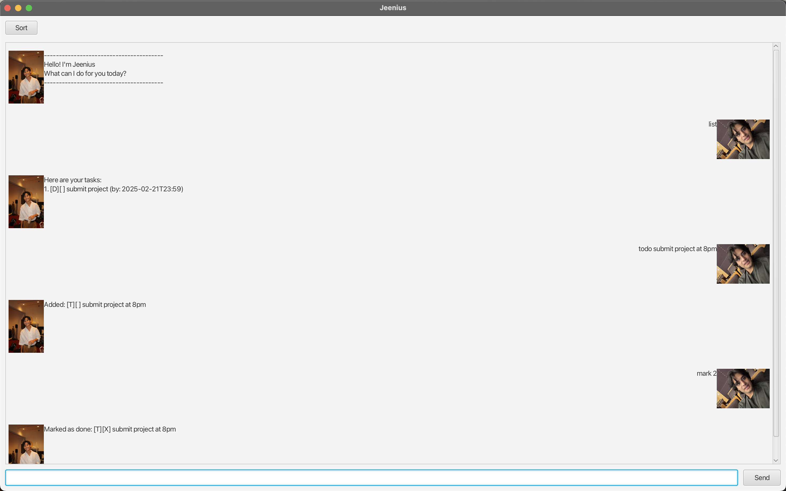

# Jeenius 



Jeenius is your all-in-one desktop smart task manager application.

## How to use Jeenius?

Simply refer to all available features below and type the command you wish to use into the text box.

## Features
### Legend:
* Words in UPPER_CASE are descriptions/date&time that you will add
* Dates should be in the format `d/M/yyyy HHmm` (e.g. `21/2/2025 2359`)

### 1. Adding tasks
You can add 3 types of tasks:

<ins> ToDo task </ins>

```declarative
How to use:  todo DESCRIPTION 
For example: todo submit project  
```

<ins> Deadline task </ins>

```declarative
How to use:  deadline DESCRIPTION /by d/M/yyyy HHmm
For example: deadline submit project /by 21/2/2025 2359
```

<ins> Event task </ins>

```declarative
How to use:  event DESCRIPTION /from d/M/yyyy HHmm /to d/M/yyyy HHmm
For example: event recess week /from 22/2/2025 0000 /to 2/3/2025 2359
```

### 2. Removing Tasks
Delete tasks that are completed

```declarative
How to use:  delete INDEX
For example: delete 1
```

### 3. List all tasks
View all your tasks in the form of a list
```declarative
How to use:  list
For example: list
```

### 4. Search task by keyword
Find tasks easily by searching keywords
```declarative
How to use:  find KEYWORD
For example: find book
```

### 5. Mark/unmark tasks
Keep track of what you have done by marking/unmarking tasks
```declarative
How to use:  mark INDEX
For example: mark 1

How to use:  unmark INDEX
For example: unmark 1
```

### 6. Sorting 
Easily view your tasks in chronological order by using this function
```declarative
How to use:  sort
For example: sort
```

### 7. Exiting the program
Quit the program by using this command
```declarative
How to use:  bye
For example: bye
```


